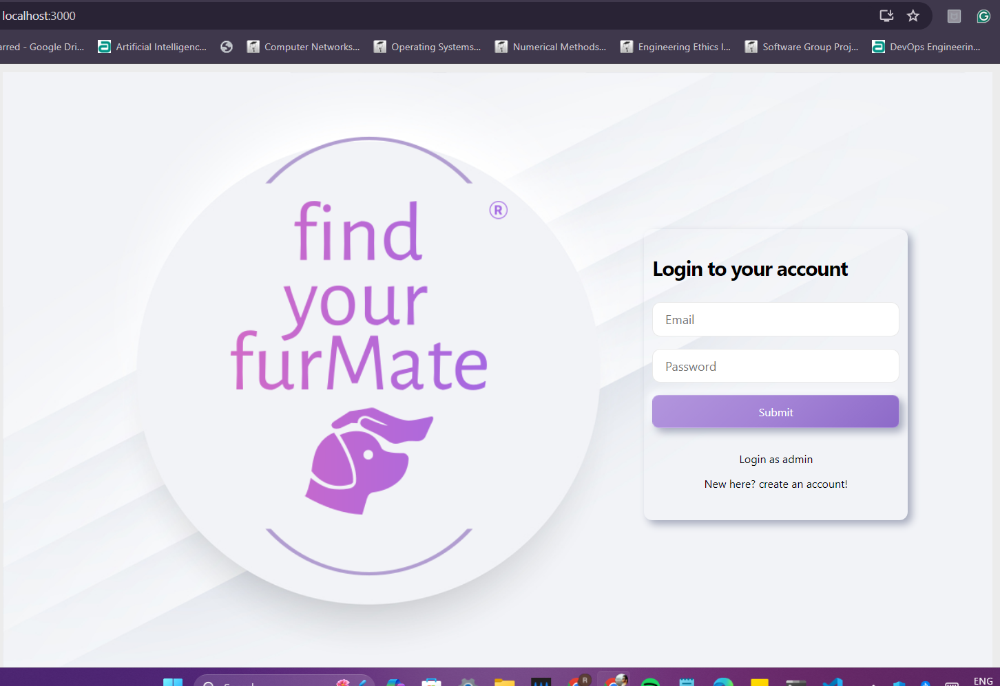

# Pet Adoption Web Application using MERN



This is a MERN (MongoDB, Express.js, React.js, Node.js) stack project for a Pet Adoption Web Application. Users can view available pets for adoption, add new pets for adoption, and adopt pets.

## Features

- User authentication: Users can sign up, log in, and log out.
- CRUD operations: Users can perform CRUD (Create, Read, Update, Delete) operations on pet listings.
- Image upload: Users can upload images of pets they want to put up for adoption.
- Search functionality: Users can search for pets based on various parameters such as breed, age, etc.
- Responsive design: The application is responsive and works seamlessly on various devices.

## Installation

To run this project locally, follow these steps:

1. Clone the repository:

   ```
   git clone https://github.com/somanshh/adopt-pet.git
   ```

2. Navigate to the project directory:

   ```
   cd adopt-pet
   ```

3. Install dependencies for backend:

   ```
   cd backend
   npm install
   npm start
   ```

4. Install dependencies for frontend:

   ```
   cd frontend
   npm install
   npm start
   ```

5. Open http://localhost:3000 or whatever port in your browser to view the application.

## Technologies Used

- **Frontend**
  - React.js
  - Redux (for state management)
  - Material UI (for styling)
- **Backend**
  - Node.js
  - Express.js
  - MongoDB (with Mongoose ODM)
- **Authentication**
  - JSON Web Tokens (JWT)
- **Others**
  - Axios (for making HTTP requests)

## Acknowledgments

- This project was inspired by the love for animals and the desire to help them find loving homes.
  
